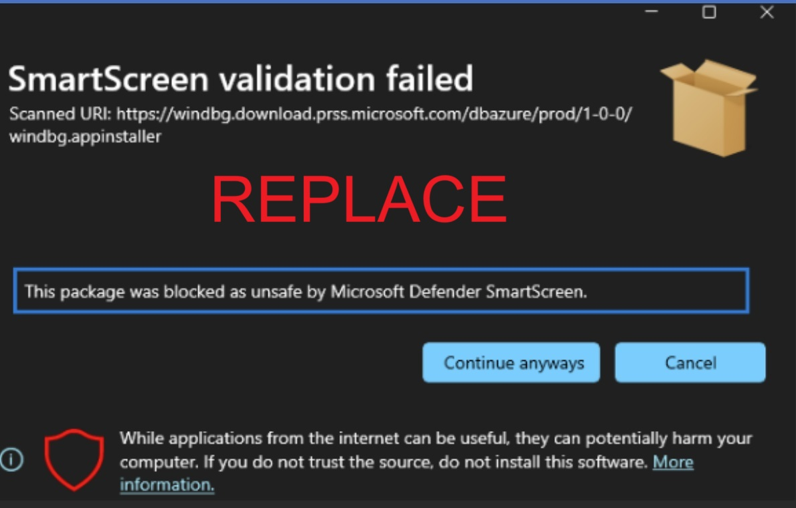
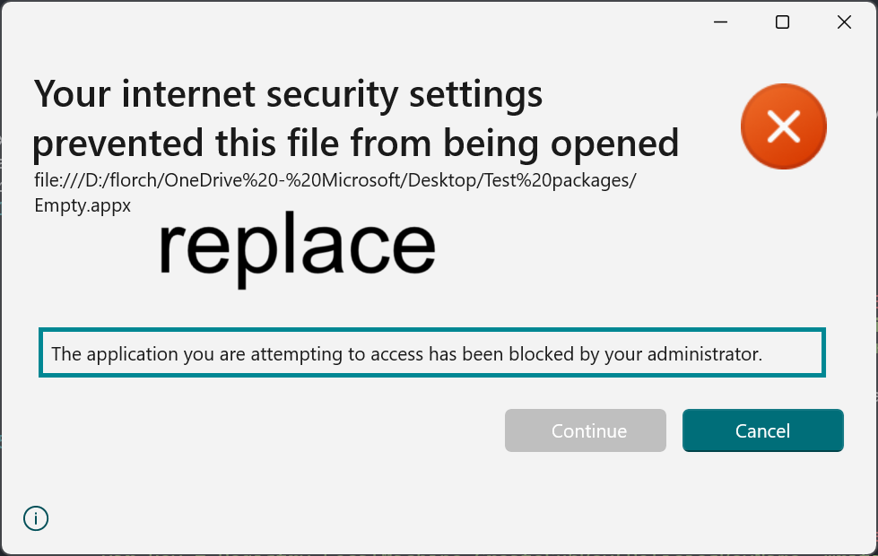

# App Installer Security Features
With build <bugbug> of the App Installer, Microsoft introduced additional security features to ensure the robustness of the platform for user and IT Professionals.

## Smart Screen Support
The App Installer now takes advantage of [Smart Screen](https://learn.microsoft.com/en-us/windows/security/operating-system-security/virus-and-threat-protection/microsoft-defender-smartscreen/) to help users make informed decsions before installing software.
Prior to opening a URI, App Installer will employ URL validation with Smart Screen. 

When presented with this error, the user can choose to **cancel** or **continue anyway**(Not recommended).

## Internet Warning
App Installer also introduced a warning bannner that will display to the user whenever the user is installing a package from the internet. 

Installing software from an untrusted site on the interenet can be risky and expose you to malware and other exploits. For more information, see [Protect yourself from online scams and attacks](https://support.microsoft.com/en-us/office/protect-yourself-from-online-scams-and-attacks-0109ae3f-fe61-4262-8dce-2ee3cd43bac7)

## Internet Zone Support
IT Pros can now prevent users from installing apps from URIs that they do not support. App Installer supports the following zone configurations for domains:

| Zone | Default | Detail 
| --- | --- | --- 
| Local Machine | Allow | Setting to *Blocked* will prevent any local MSIX from being installed.
| Intranet | Allow | Setting to *Blocked* will prevent files from enterprise servers from being downloaded and installed.
| Trusted Sites | Allow | Used in conjunction with Internet, allows the IT professional to allow specific Internet URIs.
|Internet | Allow | Used in conjunction with Truseted Sites, allows the IT professional to restrict installing apps from all Internet URIs.
| Untrusted Sites | Blocked | Used in conjunction with Truseted Sites, and Internet, allows the IT professional to block specific Internet URIs.

